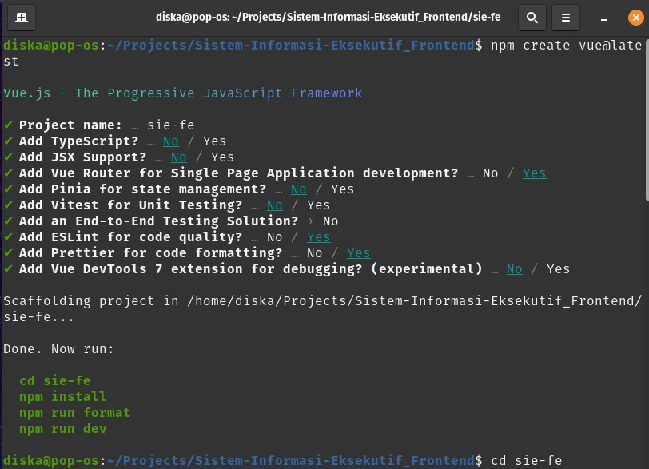

# sie-fe

This template should help get you started developing with Vue 3 in Vite.



## Recommended IDE Setup

[VSCode](https://code.visualstudio.com/) + [Volar](https://marketplace.visualstudio.com/items?itemName=Vue.volar) (and disable Vetur).

## Customize configuration

See [Vite Configuration Reference](https://vitejs.dev/config/).

## Project Setup

```sh
npm install
```

### Compile and Hot-Reload for Development

```sh
npm run dev
```

### Compile and Minify for Production

```sh
npm run build
```

### Lint with [ESLint](https://eslint.org/)

```sh
npm run lint
```

### Form Validate with [VeeValidate](https://vee-validate.logaretm.com/v4/guide/overview/)

vee-validate@4.13.2

```sh
npm i vee-validate --save
```

### Schema Validate with [Yup Validation](https://vee-validate.logaretm.com/v4/guide/overview/)

yup@1.4.0

```sh
npm install yup@1.4.0
```

### Vue Router with [Vue Router V4](https://router.vuejs.org/installation.html)

vue-router@4.4.2

```sh
npm install vue-router@4
```

### FontAwesome for Icon [FontAwesome V6](https://fontawesome.com/v5/icons/bootstrap?f=brands&s=solid)

fortawesome/fontawesome-free@6.6.0
fortawesome/fontawesome-svg-core@6.6.0
fortawesome/free-solid-svg-icons@6.6.0

```sh
npm install @fortawesome/fontawesome-free@6.6.0 @fortawesome/fontawesome-svg-core@6.6.0 @fortawesome/free-solid-svg-icons@6.6.0 @fortawesome/vue-fontawesome@3.0.8
```

### Bootstrap 5.3.3 [Bootstrap V5](https://getbootstrap.com/docs/5.0/getting-started/introduction/)

bootstrap@5.3.3

```sh
npm install bootstrap@5.3.3
```

### Vue3 Lottie for Animation [Vue3 Lottie](https://www.npmjs.com/package/vue3-lottie)

vue3-lottie@3.3.0

```sh
npm i vue3-lottie
```

npm list
├── @fortawesome/fontawesome-free@6.6.0
├── @fortawesome/fontawesome-svg-core@6.6.0
├── @fortawesome/free-solid-svg-icons@6.6.0
├── @fortawesome/vue-fontawesome@3.0.8
├── @iconify/vue@4.1.2
├── @lottiefiles/dotlottie-vue@0.4.9
├── @rushstack/eslint-patch@1.10.4
├── @vitejs/plugin-vue@5.1.2
├── @vue/eslint-config-prettier@9.0.0
├── bootstrap@5.3.3
├── eslint-plugin-vue@9.27.0
├── eslint@8.57.0
├── lottie-web@5.12.2
├── prettier@3.3.3
├── vee-validate@4.13.2
├── vite@5.3.5
├── vue-router@4.4.2
├── vue@3.4.35
├── vue3-lottie@3.3.0
└── yup@1.4.0
